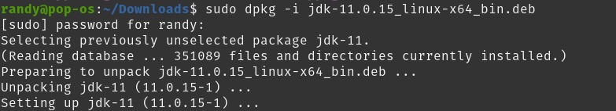
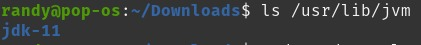
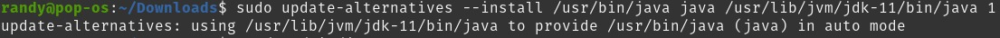
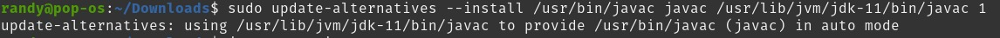
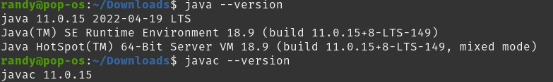
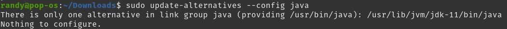
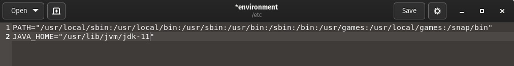
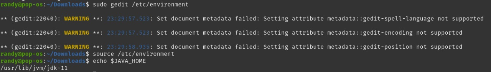

# JAVA  

## Introduction

Java is a programming language that is commonly used to develop back-end parts of software, Android applications, and websites. Java is also known to have the motto "Write Once, Run Anywhere". This means that Java can run on various platforms without needing to be rearranged to suit the platform. For example, it runs on Android, Linux, Windows and more. This can happen because Java has a high-level syntax or programming code system. Where when executed, the syntax will be compiled with the Java Virtual Machine (JVM) into a numeric code (bytes code) platform. So that Java applications can be run on various devices.

## Installation Java on local machine using Unix system - 

how to install Oracle’s official JDK and JRE?

To install the Oracle JDK, which is the official version distributed by Oracle, you must create an Oracle account and manually download the JDK to add a new package repository for the version you’d like to use. 

Then visit the [Downloads page](https://www.oracle.com/java/technologies/javase/jdk11-archive-downloads.html) and locate the version that matches the one you need.

in my case, I want to install [JDK11](https://www.oracle.com/java/technologies/javase/jdk11-archive-downloads.html)

You’ll be presented with a screen asking you to accept the Oracle license agreement. Select the checkbox to accept the license agreement and press the Download button. Your download will begin. You may need to log in to your Oracle account one more time before the download starts.

## Installing Java with Terminal

if your download is complete then you have to go into your download folder which contains the JDK.

example output:

 

Update your package list to make the new software available for installation:

```
sudo apt update
```

Next, to run this ```.deb``` file we need to extract it using the following code:

```
sudo dpkg -i jdk-11.0.15_linux-x64_bin.deb
```
 

if you download the JDK with a different version then adjust the file name

## Managing Java

you need to make sure the JDK version that has been extracted before doing manage java

```
ls /usr/lib/jvm
```

example output:

 

You can have multiple Java installations on one server. You can configure which version is the default for use on the command line by using the update-alternatives command.

```
sudo update-alternatives --install /usr/bin/java java /usr/lib/jvm/jdk-11/bin/java 1
```

example output:
 

You can do this for other Java commands, such as the compiler (javac):

```
sudo update-alternatives --install /usr/bin/javac javac /usr/lib/jvm/jdk-11/bin/javac 1
```

example output:
 

You can verify which version of java has been installed on your local machine, just by giving this command

```
java --version
javac --version
```

example output:

 

## Setting the JAVA_HOME Environment Variable

Many programs written using Java use the JAVA_HOME environment variable to determine the Java installation location.

To set this environment variable, first determine where Java is installed. Use the update-alternatives command:

```
sudo update-alternatives --config java
```

example output:
 

Copy the path from your preferred installation. Then open /etc/environment using ```gedit or nano``` or your favorite text editor:

```
sudo gedit /etc/environment
```
At the end of this file, add the following line, making sure to replace the path with your own copied path, but don't include the bin/ part of the path:

example:
 

Modifying this file will set the JAVA_HOME path for all users on your system.

Save the file and exit the editor.

Now reload this file to apply the changes to your current session:

```
source /etc/environment
```

Verify that the environment variable is set:

```
echo $JAVA_HOME
```
and You’ll see the path you just set

example:
 


